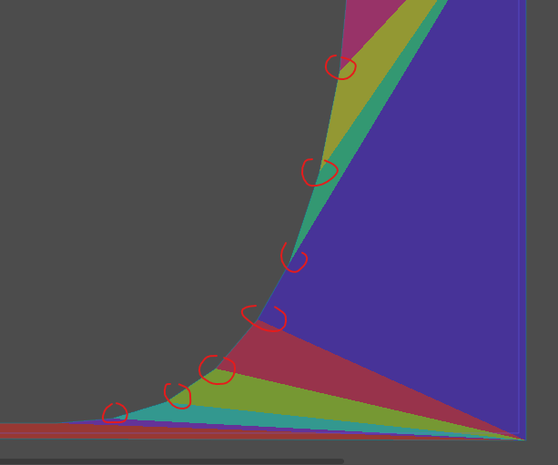
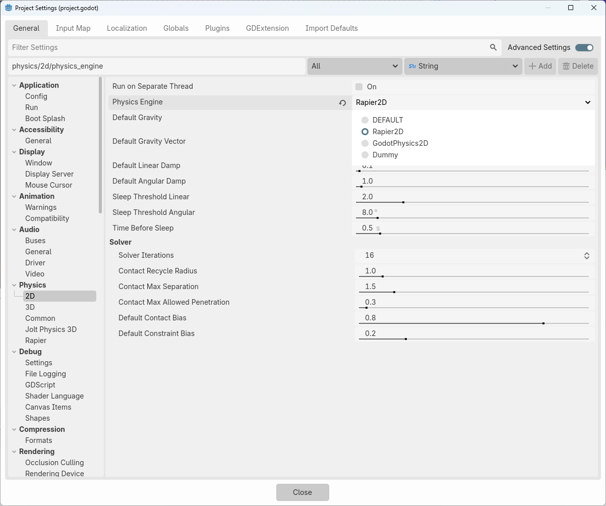

Reproduction for issue with `CharacterBody2D` `move_and_slide()` with Godot Rapier `v0.35.2`

When moving laterally on a curved slope, with Rapier 2D the body often gets stuck where the angle changes:

### Rapier

https://github.com/user-attachments/assets/07d29f3d-fced-4c61-8576-c5bd533fe7a3

### Default Physics

https://github.com/user-attachments/assets/46ed7be8-ede3-4ca6-832b-e83f0cc0fefe

## Controls

| keyboard | controller | action |
|-|-|-|
| arrow-right, d | left-stick right | move_right |
| arrow-left, a | left-stick left | move_left |
| space | face-button a (xbox) | jump |

## How to switch the physics engine

